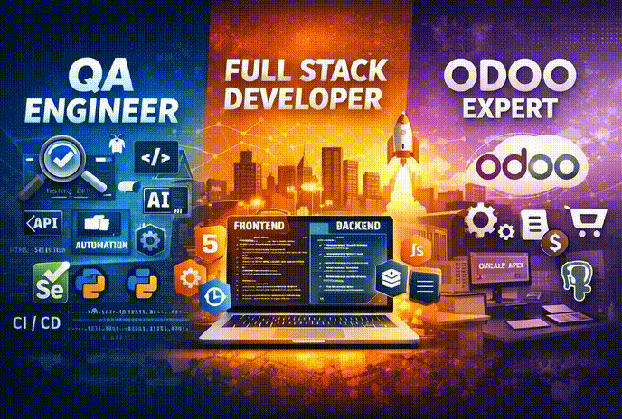

<!-- BANNER -->
<p align="center">
  
</p>

<h2 align="center">💻 Backend Engineer • 🧪 QA Automation • 🎬 Video Editor • 🤖 AI Explorer</h2>

<p align="center">
  <a href="https://www.linkedin.com/in/oscar-danilo-castelblanco" target="_blank">
    
  </a>
  <a href="mailto:oscard.castelblanco@gmail.com">
    
  </a>
</p>
---

## 🎬 Cinematic Intro

<p align="center">
  
</p>

---

## 🧠 About Me

I'm a Software Engineer with 5+ years of experience building enterprise backend systems.

Currently evolving into **QA Automation**, integrating testing strategies into development workflows to build reliable, scalable and high-performance systems.

Beyond engineering, I work with **Video Editing & AI-powered workflows**, combining technology and creativity to build digital experiences with impact.

> Build. Test. Improve. Create.

---

## 🚀 Tech Visual Showcase

<p align="center">
  
</p>

---

## 🚀 Tech Stack

### 💻 Backend & Development
<p>

</p>

### 🗄 Databases
<p>


</p>

### 🧪 QA & Testing Focus
<p>


</p>

### 🎬 Creative & AI Tools
<p>


</p>

---

## 📌 Featured Projects

### 🚗 Parking Backend API
Flask + SQLAlchemy business-driven backend.
- Capacity validation
- Revenue calculations
- Swagger documentation
- Structured architecture

### 📦 Perishable Inventory API
FastAPI modular system.
- Expiration tracking
- Pydantic validation
- Clean REST architecture
- Scalable design

---

## 🔥 Now Building...

- 🧪 QA Automation Framework (API-based)
- ⚙ CI/CD integration for backend testing
- 🤖 AI-assisted productivity workflows
- 📈 Improving system observability & logging

---

## 📊 GitHub Metrics

<p align="center">
  
</p>

<p align="center">
  
</p>

<p align="center">
  
</p>

---

## ⚡ Engineering Philosophy

```python
while True:
    build()
    test()
    optimize()
    create()
